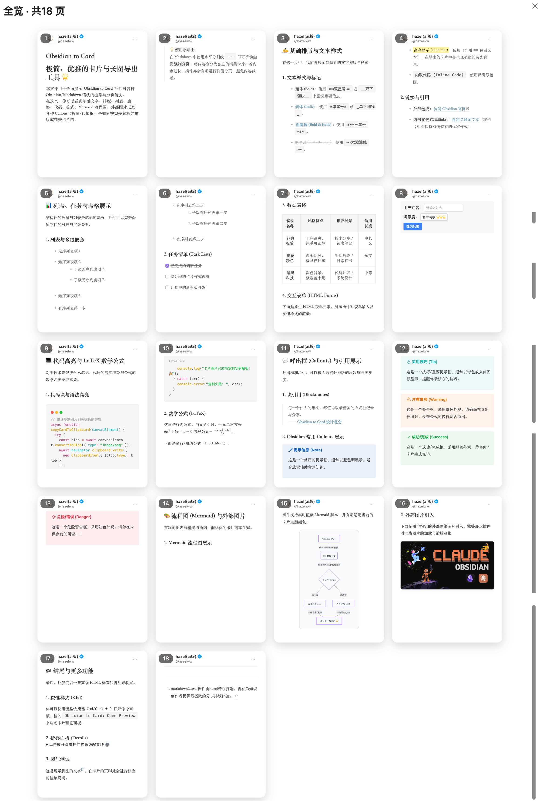
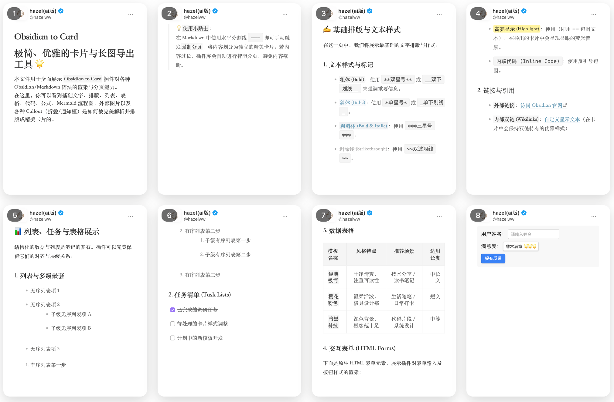
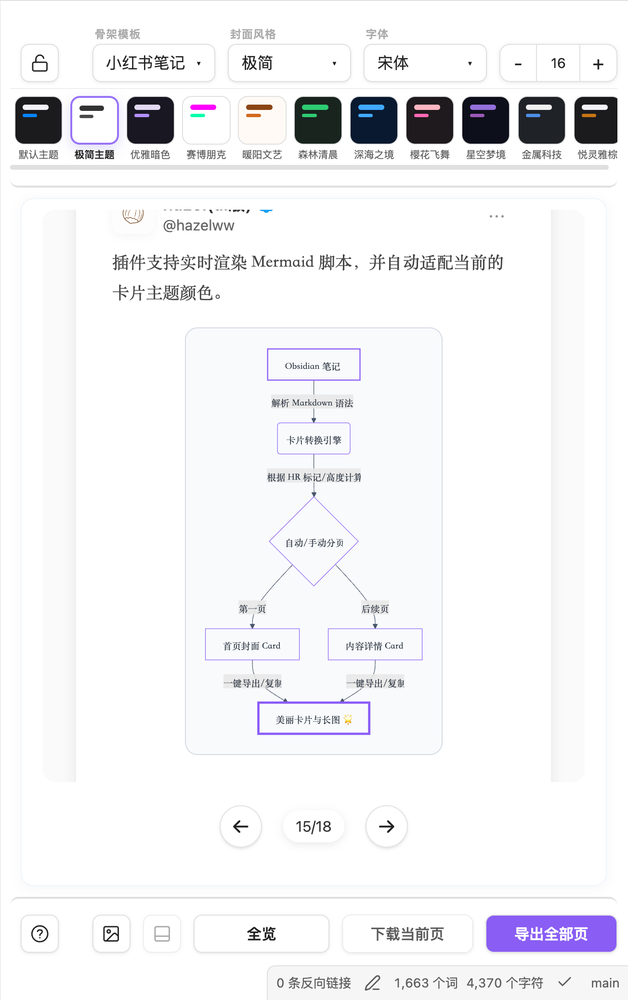
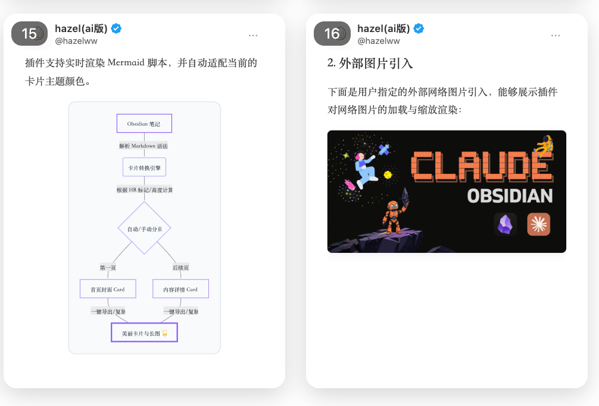
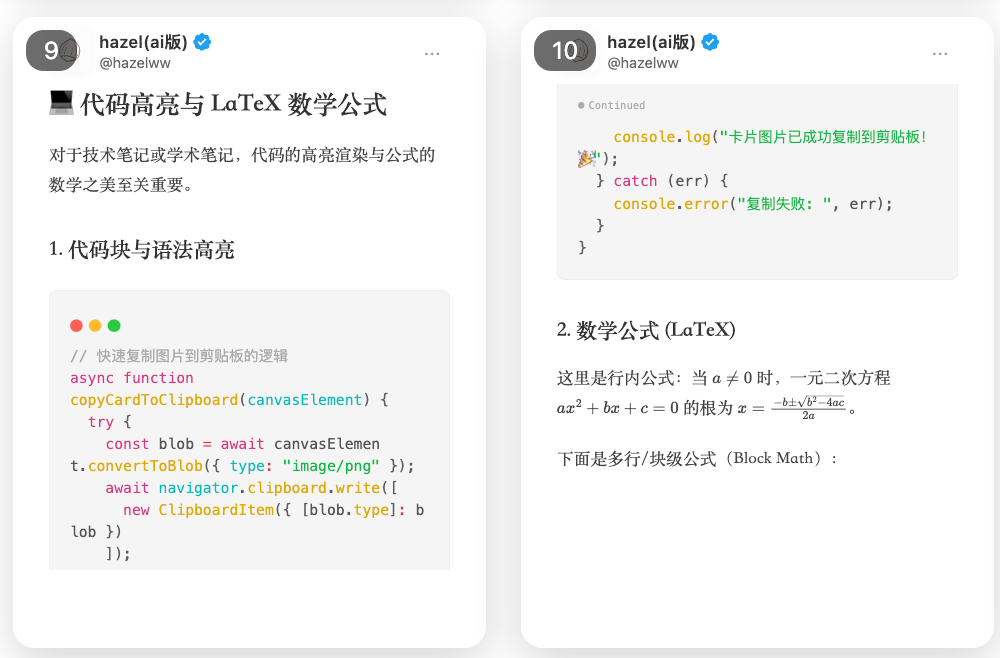

# markdown2card

Language: English | [简体中文](./README.zh-CN.md)

## Preview


*Card Flow Overview: A multi-page grid preview of the generated cards, showing the full flow layout.*


*Card Details: A close-up view of a single card's rendering details, showcasing precise typography, margins, and background styles.*


*Settings Panel: A feature-rich settings sidebar that allows switching themes, selecting custom background styles and fonts, adjusting footer visibility, and providing one-click copy or export actions.*


*Mermaid & Image Support: Renders embedded images and Mermaid diagrams safely inside cards. Long portrait images receive a dedicated full card instead of being split across pages, while oversized Mermaid diagrams can be appended at their original aspect ratio during export.*


*Auto-Pagination, Code Blocks & LaTeX: Supports rendering and syntax highlighting for code blocks and LaTeX math formulas, with automatic physical pagination based on actual card height to prevent content clipping.*

---

This repository contains the source for the `markdown2card` Obsidian plugin.
It renders the active Markdown note as exportable social-card images.

## What It Does

- Opens a dedicated `markdown2card` preview view inside Obsidian.
- Converts Markdown into fixed-ratio image cards with live preview.
- Automatically paginates long content by the actual rendered card height, so content is not silently clipped.
- Resets the preview viewport when switching notes, while preserving the current scroll position during same-note live updates.
- Keeps preview and source navigation aligned: clicking a generated card moves the Obsidian editor to that card's first source block, including cards created by automatic pagination.
- Supports manual page breaks with `---`.
- Keeps ordinary images fully visible by default. Portrait images that would exceed the available card height are promoted to a dedicated image card and are never split across multiple cards.
- Provides fixed-frame image reframing: crop mode keeps the image frame ratio fixed, fills the frame, and lets users zoom or drag the image to choose the visible area. Zoom and reset controls are enabled only in crop mode; editor controls are excluded from exports.
- Renders Mermaid diagrams into card-safe SVG blocks, including dark-theme contrast fixes, auto scaling for oversized diagrams, and appended original-size Mermaid exports when a diagram would exceed the card.
- Provides multiple image templates, including default, notes, Xiaohongshu, Weibo, WeChat, magazine, quote, terminal, GitHub, and signature styles.
- Supports theme switching, cover styles, custom fonts, background images, footer visibility, persistent per-image reframing, table scaling, current-page export, all-pages export, and clipboard copy.
- Lets users choose the preview UI language, defaulting to English with a Chinese option.
- Writes exports to a configurable destination. Relative paths are written inside the vault; absolute macOS/Linux or Windows paths are written to the file system.
- Supports ZIP archive output or a PNG folder named after the current Markdown file.
- Can optionally run post-export actions that mark the source note as source material, create a publish-ready Markdown note, and link the exported assets.
- Integrates AI-powered rewriting through either Google Gemini or the local `agy` CLI to transform note content into engaging social-media copy during post-export.

## Template Notes

- Xiaohongshu template keeps the bottom interaction bar and distributes likes, favorites, and comments evenly.
- Weibo template uses a Weibo-style header with uploadable avatar, red V badge, current time, editable saved location, and a follow button. It disables the bottom footer area.
- Templates that remove the footer free that space for auto pagination.

## AI Rewriting & Marketing Copy

When post-export actions are enabled, you can toggle AI rewriting and choose either the Gemini API or a local `agy -p` command:
- **Provider Selection**: Keep the API-key workflow with Gemini, or run the configured local agy executable. The local provider passes the complete prompt as the `-p` argument and uses agy's standard output as the publish body.
- **Local agy Path**: Configure an executable name or absolute path. GUI-launched Obsidian instances often have a minimal `PATH`, so an absolute path such as `/Users/name/.local/bin/agy` is recommended.
- **Local agy Proxy**: Optionally configure a proxy URL and `NO_PROXY` list. The plugin supplies the proxy as both uppercase and lowercase `HTTP_PROXY`, `HTTPS_PROXY`, and `ALL_PROXY` variables to the agy child process.
- **Masked Credentials**: The Gemini API Key input field is masked (`password` field type) to prevent accidental exposure during screenshots or screen-shares.
- **Customizable Model**: Enter any Gemini model identifier supported by your API key (default: `gemini-3.5-flash`).
- **Gemini Base URL**: Specify an optional Gemini API base URL or gateway endpoint.
- **Custom Prompt Template**: Customize the AI prompt template using the `${content}` placeholder to tailor the output structure, tone, and hashtags.
- **Word/Character Count Threshold**: Specify a character count threshold (default: 800 characters) below which the AI rewriting step is skipped, allowing short posts to be exported directly without redundant API calls.
- **Social Tags Extraction**: Automatically extracts hashtags (`#tag`) from the post body, removes them from the text to keep the main copy clean, and populates them as a list under the `publish_social_tags` field in the YAML frontmatter of the publish-ready package.
- **Localized Default Prompts**: Default prompts are localized based on the user's interface language setting (English or Chinese). Switching the interface language automatically updates default prompts to match while preserving any custom prompts you have configured. The prompt requires the AI to output in the same language as the source article.
- **Image-Free Publish Body**: Markdown images and Obsidian image embeds are removed before the rewrite request and sanitized from the generated result again. Non-image embeds and image-looking examples inside inline or fenced code are preserved.
- **Robust Fallback**: If the selected provider fails or returns no content, a toast notification with the error is shown, and the plugin uses the already-sanitized source body without image references, ensuring the export pipeline never breaks.

## Development

```bash
npm install
npm test
npm run build
```

The build emits `main.js` next to `manifest.json` and `styles.css`, matching the
layout expected by Obsidian community plugins.

Automated tests cover image sizing, standalone-page classification, crop-control behavior,
layout measurement fallbacks, source-line mapping, preview-scroll reset behavior, export filtering, publish-body image sanitization, and local agy argument/proxy propagation. For UI changes, run `npm test` and
`npm run build`, then manually verify preview generation, auto pagination, Mermaid rendering,
preview/editor navigation, file-switch scroll reset, first-enable rendering, template switching, theme switching, language switching, export path handling,
ZIP and PNG-folder export formats, optional post-export Markdown metadata updates,
long-image cards, image reframing, appended oversized Mermaid exports, and copy behavior in an Obsidian vault.

## License and Paid Access

This plugin is published by AI-Vibe under the [Hazel Source-Available License 1.0](./LICENSE). The Hazel Materials are source-available, not open source: source inspection, official-release use, private modification, and contributions are permitted, but redistribution of modified versions or builds is prohibited. Upstream Note to RED materials remain available under the MIT License described in the license file.

The plugin includes a payment prompt, and access to applicable features may require payment. The current access conditions are presented in the plugin. Unofficial builds that remove or bypass payment or access controls may not be distributed.
